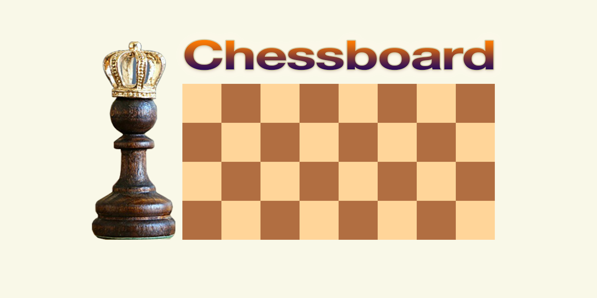

## Designing Chessboard

# Description

In this simple responsive chessboard, a divide-and-conquer algorithm has been used. Chessboard is divided into four big quarters.
Each big quarter is divided into four small quarters with four squares.
CSS flex and grid have been used for aligning quarters.   

## Built With

 &nbsp;  

## Tools Used

